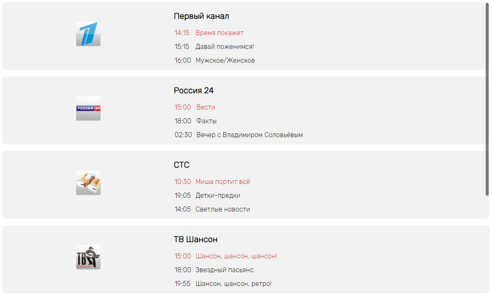

# VideoService
Небольшое приложение, предоставляющее функционал видео сервиса.

## Что было использовано в этом проекте
**Flexbox** Основные блоки сверстаны на основе Flexbox, это добавляет гибкости при смене разрешения эрана;  
**Cookie** При входе на сайт, логин запоминается при помощи Cookie, что позволяет сохранить авторизацию даже при перезагрузке страницы;  
**Get запрос Api** Фильмы и ТВ программа сделаны динамически, берут информацию из API, которое было составлено самостоятельно;  
**Работа с временем** ТВ программа отображает передачи согласно текущему времени;  
**Scrollbar** Для блока с ТВ-каналами сделан кастомный скролбар;  

**Кроссбраузерность**Приложение кроссбраузерное и корректно отображает в разных браузерах;  
**Табы** Реализовано переключение между табами;  
**Эффекты при наведении** При наведении на обложку фильма, появляется его краткое описание. При наведении на карточку жанров, она меняет цвет.

